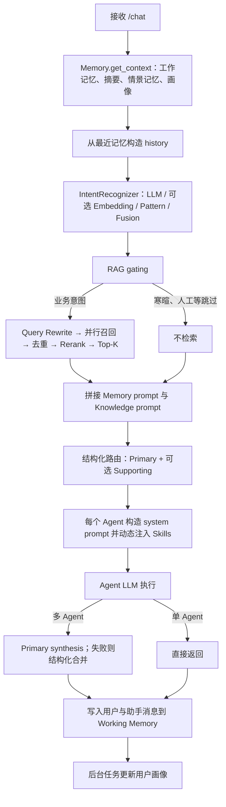

# RelayDesk Current Design Rationale Benchmark

> 报告语言：中文  
> 基准性质：**Reconstructed Baseline（重建基线）**  
> 基准提交：`b27f122f918a42485afb300dacb6d547de47bd40`  
> 执行日期：2026-08-20 至 2026-08-21；SaaS 场景复测：2026-08-23（Asia/Shanghai）
> 重要边界：本文验证“当前设计相对构造基线是否合理”，不把构造基线描述为真实历史版本，不虚构线上指标、用户反馈或历史演进。

## SaaS 场景复测摘要（2026-08-23）

当前业务口径已从内部员工服务入口收敛为：**面向外部企业客户的企业级 SaaS 统一客户服务平台**。Agent、Intent 枚举、API、Tool、Memory 和路由架构均未改变；Skills、20 篇默认知识、前端文案、默认 Evaluation 与 25 条 RAG 数据已换成租户、Workspace/Organization、SSO、API Token、Webhook/SDK、套餐/席位/订阅语境。

真实加载 `Qwen/Qwen3-Embedding-0.6B` 后重新编码当前 20 篇 SaaS 知识并运行 25 条检索：22 条有答案样本的 Recall@1/3/5 为 `0.7727/0.9545/1.0000`，MRR 为 `0.8879`，P50/P95 为 `180.841/242.649ms`。相对重建的旧默认模型结果，22 条有答案查询全部改善，3 条无答案查询排名状态不变，没有正例退步。

本轮仍暴露两个真实 Bad Case：`RAG-013` 的“扣款但套餐未开通”只排第 3，`RAG-019` 的“多次未解决且影响整个租户”只排第 5；它们虽然进入 Top-5，但 Top-1 仍会选到相邻文档。3 条无答案查询的最高分为 `0.4209/0.4787/0.4523`，当前正例目标文档最低分为 `0.4927`，因此默认 `RAG_MIN_SCORE` 从 `0.45` 微调为 `0.48`。这个阈值只在小型同域样本上形成初始分界，不能视为生产环境充分校准。

代码回归通过 `12/12`；系统默认 Python 因缺少 `anthropic` 依赖无法收集测试，改用隔离项目环境后全部通过。以下 Rewrite/Rerank、Judge、路由、Skills 与 Tool 数据仍是上一轮设计理由实验；其中旧模型的坏案例保留为历史诊断，不能与本轮 SaaS 语料的 Qwen3 数字混作同一次严格模型对照。

## 最前面直接回答十个问题

### Q1. 相比最简单 LLM-only Intent，当前三路 Intent Fusion 到底提升了什么？

**模型接口已经恢复，但结构化输出仍不稳定。** 最小调用成功，耗时 `955.395ms`；47 条 Intent 调用中 26 条成功解析 JSON、21 条因输出截断退化为 `OTHER`。按真实运行结果，LLM Only Accuracy/Macro-F1 为 `0.5556/0.5599`，Current Fusion 为 `0.5333/0.5354`，本轮 Current 没有优于 LLM Only，反而分别低 `0.0223/0.0245`。

可复现的组件诊断仍显示 Pattern 单分支 Accuracy 为 `0.4889`、Macro-F1 为 `0.4968`。本轮权重消融已执行，但结果受 44.68% 的 LLM 结构化输出失败率影响，只能解释为当前运行配置的可靠性表现，不能用于宣称权重最优。

本次默认模型已切换为与 LLM Provider 解耦的 `Qwen/Qwen3-Embedding-0.6B`。即使 `.env` 使用 DeepSeek 兼容端点，正式代码也会执行 **LLM 70% + Embedding 20% + Pattern 10%**。Embedding-only 组件诊断中，Qwen3 Accuracy/Macro-F1 为 `0.4444/0.4040`，高于原字符 n-gram 的 `0.2889/0.2520`，但略低于此前 BGE 的 `0.4667/0.4412`；因此不能把 Embedding 单分支当作主分类器，也尚未重跑新的 LLM 三路端到端 Accuracy。

### Q2. 相比 Direct ChromaDB Retrieval，Query Rewrite 到底解决了哪些真实 Bad Cases？

旧 `all-MiniLM-L6-v2` 基线下，四组 RAG 已按正式参数真实运行，但 Query Rewrite 没有提高召回。25 次 Rewrite 调用只有 1 次生成有效多查询，24 次因 `max_tokens` 截断回退为原查询，因此四组 Recall@1/3/5 和 MRR 全部相同，为 `0.0909/0.3636/0.5227/0.2303`。

为区分“机制无效”和“输出预算不兼容”，又从 Direct 漏召回中固定选取 6 个困难案例，将**评测适配器**的结构化输出下限从 256 临时提高到 4096，正式代码和配置不变。6 次 Rewrite 均成功输出查询；Direct Top-5 为 `0/6`，Rewrite Top-5 为 `3/6`，Rewrite+Rerank Top-5 为 `4/6`。其中“`forbidden`”案例从 Direct Top-5 外进入最终第 1，“秒退”“两条一样的交易”“退的钱几天回原账户”分别进入第 2/5/4。

最终采用的 Qwen3 Direct 在 SaaS 化后的 22 条有答案数据上达到 Recall@1/3/5 `0.7727/0.9545/1.0000`、MRR `0.8879`。查询侧使用企业 SaaS 客户支持专用英文 instruction，文档侧不添加 instruction；相对重建的旧 Direct 结果，22 条有答案查询全部改善，3 条无答案查询排名状态不变。因此当前最高优先级结论是：**先使用更合适的基础 Embedding 解决候选召回，再决定是否值得承担 Rewrite/Rerank 的 LLM 延迟。**

### Q3. Rerank 主要提升 Recall 还是 Ranking Quality？

从机制看，Rerank 目标仍是 **Ranking Quality / MRR**。正式参数下，Rerank Only 发起 25 次调用，全部在 256 Token 上限结束且没有最终文本，生产逻辑回退为原排序，所以 MRR 仍为 `0.2303`。

6 条兼容性诊断中，Rewrite+Rerank 相比 Rewrite 将 MRR 从 `0.1583` 提到 `0.3250`，主要由 403 文档从 Top-5 外提升到第 1 驱动；但该阶段只有 3/6 次得到模型结果，另外 3 次触发 30 秒超时。Rerank Only 的 6 次则全部超时，排序完全未变。它说明 Rerank 在候选已召回时能改善顺序，也说明当前推理模型的延迟不满足在线链路要求，不能直接把 4096 设为生产修复。

Qwen3 Direct 的 MRR 已达到 `0.8879`，所以 Rerank 的边际空间明显缩小。现阶段 Rerank 应从“必须执行的默认步骤”降为“在候选接近或复合请求时再评估的可选优化”；本轮没有修改既有 Rerank 控制流，但后续不应优先投入。

### Q4. 相比 Single General Agent，Multi-Agent 到底解决了什么问题？

在 12 条固定 gold intent 的确定性路由基准上，Single General 的必要角色关注点覆盖率为 `0.1667`，Current Primary + Supporting 为 `1.0000`，角色集合完全匹配率也从 `0.1667` 到 `1.0000`。这说明当前结构确实解决了“请求应交给哪个专业角色、复合请求是否覆盖两个专业角色”的问题。

但回答内容没有执行，因此不能把角色覆盖率解释成 Correctness、Completeness 或用户体验提升。

### Q5. 相比 Primary-Agent Only，Supporting Agent 什么时候真正有价值？

在本数据集的 5 条双领域样本中，Supporting Agent 补上了 Primary-only 缺失的第二专业角色，包括 401 + 重复扣款、500 + 重复支付、订阅 + 崩溃、账户安全 + 陌生扣款、发票 + 500。整体关注点角色覆盖率从 Primary-only 的 `0.7917` 提升到 Current 的 `1.0000`。

对单领域问题，Primary-only 已覆盖必要角色；此时 Supporting Agent 没有结构收益，不应无条件启用。当前实现由最终 Intent 直接映射 Primary，只在 Technical 与 Billing 之间用集中维护的强关键词或强 Entity 检查第二领域，不再使用 Domain Score、Supporting 分数阈值或 Primary 比例阈值。

### Q6. 相比直接拼历史聊天，分层 Memory 为什么值得存在？

当前代码提供工作记忆、会话摘要、情景记忆和用户画像四类上下文，可针对长期事实、跨会话偏好和上下文预算分别处理；直接拼历史无法同时解决无限增长和旧事实检索。

不过本轮只验证了 `MemoryContext` 的结构与 prompt 格式，摘要压缩、画像提取、跨会话召回和事实保留率均 `NOT EXECUTED / 未执行`。因此“值得存在”目前是工程合理性判断，不是效果已被证明。`COMPRESS_AT=15`、保留最近 5 条和 24h TTL 都只是配置，不是效果证据。

### Q7. Dynamic Skills 相比全量 system prompt 有什么实际收益？

在 SaaS 化后的 9 条 General/Technical/Billing 样本上，全量注入平均 `3888` 字符，Dynamic Skills 平均 `1356.44` 字符，减少 `65.11%`；无关 Skill 数从平均 `2.0` 降到 `0`，必要 Skill 覆盖率为 `1.0000`。这是本轮较强的结构证据。

回答级 Rule Compliance 未执行，所以不能进一步声称动态注入让答案更准确；这属于保留的小范围证据边界，不影响 prompt 缩减结论。

### Q8. Tool Cache / Timeout / Breaker / Fallback 分别解决什么真实故障？

- Cache：相同参数两次调用，handler 实际调用从 `2` 次降到 `1` 次。
- Timeout：0.2 秒慢请求在故障注入阈值 0.05 秒下约 `52.177ms` 返回 fallback，而 V0 等待约 `201.216ms`。正式默认 timeout 是 30 秒，本轮缩短值只用于验证机制。
- Breaker：连续 5 次失败后状态变为 OPEN；第 6 次没有调用 handler；恢复窗口后探测成功并回到 CLOSED。
- Fallback：慢请求、永久阻塞和 handler 异常都返回结构化降级结果，避免异常直接冒泡或主链路无限等待。

### Q9. 当前哪些参数有实验支持，哪些只是经验配置？

本轮支持的是**机制**，不是正式参数最优性：按需 Skills 能减少 prompt；Primary + Supporting 能覆盖复合领域；Cache/Timeout/Breaker/Fallback 状态机按预期工作。

以下仍主要是经验配置：Intent 的 70/20/10、置信度阈值 0.5、Supporting 强证据词表、Top-K、20 秒 RAG timeout、Tool 30 秒 timeout、熔断 5 次/60 秒、Memory 15 条压缩/保留 5 条/24h TTL。路由不再使用 Supporting 分数阈值；Qwen3 的 `RAG_MIN_SCORE=0.48` 仅由当前 22 条正例和 3 条负例给出一个保守起点，不是充分校准的最优值。

### Q10. “为什么要这样设计？”当前测试能给出哪些真实、可复现的证据？

可以说：

1. 将旧默认 Embedding 替换为 Qwen3，并将知识和查询统一到 SaaS 语境后，Direct Recall@5 从重建基线的 `0.5227` 提升到 `1.0000`，MRR 从 `0.2303` 提升到 `0.8879`；22 条有答案样本全部改善，3 条无答案样本排名状态不变。
2. Current 路由在手工标注的 12 条角色覆盖数据上达到 `1.0000`，而 General-only 为 `0.1667`、Primary-only 为 `0.7917`。
3. Dynamic Skills 将平均 prompt 字符减少 `65.11%`，同时保持必要 Skill 覆盖。
4. Tool 治理在缓存、超时、异常、连续故障和恢复注入下均表现出预期保护行为。

不能说：新的三路 Intent 已优于 LLM Only、Qwen3 在真实大规模知识库仍能保持当前召回、Rerank 已带来线上净收益、多 Agent 已提高回答质量或分层 Memory 已提高事实保留。Judge 27 次调用中仅 10 次有效；聚合均分能区分高/中/低质量，但重复稳定性尚不足。

---

## 1. Executive Summary

本次先完成 Current Design Rationale 只读验证，随后根据 Hugging Face/MTEB 候选与项目内复测切换到本地 Qwen3 Embedding，让 Intent 与 RAG 共用同一模型实例，并使用独立 Chroma collection 防止新旧向量混用。API 字段、Agent、Intent 枚举、Tool 和 Memory 框架均未改变。

结论分三层：

| 证据等级 | 结论 |
|---|---|
| 较强、已执行 | Qwen3 Direct 检索改善；路由的角色关注点覆盖；Dynamic Skills 的 prompt 缩减与污染减少；Tool 生命周期可靠性 |
| 已执行但暴露兼容性问题 | Intent LLM 分支、四组 RAG、Judge 调用均已真实发起；结构化输出截断导致大量 fallback |
| 仍是工程假设 | 分层 Memory 效果；多 Agent 回答质量；回答级 Skills 合规性；Judge 重复稳定性 |

最重要的硬结论是：**原 RAG 低召回的第一瓶颈是默认 Embedding 的中文语义适配，而不是缺少更复杂的 Rewrite/Rerank。Qwen3 在小型固定集上解决了旧基线的大部分问题；LLM 结构化输出和 Rerank 超时仍存在，但优先级已下降。**

## 2. Test Environment

| 项目 | 实测值 |
|---|---|
| Commit | `f9c2afc4ffa620a34415fab159555a0892d1a7f9`（测试分支基线） |
| Python | `3.9.6` |
| 执行时间 | 2026-08-20 至 2026-08-21 |
| LLM Provider | `api.deepseek.com` |
| Model | `deepseek-v4-pro` |
| 模型预检 | 成功；`955.395ms`，输入 88 / 输出 8 Token |
| Redis | TCP 可连接 |
| ChromaDB | TCP 可连接 |
| 当前 Intent 模式 | LLM 70% + Qwen3 Embedding 20% + Pattern 10% |
| Embedding | `Qwen/Qwen3-Embedding-0.6B`，1024 维，本地 CPU，归一化 |
| RAG collection | `knowledge_base_qwen3_embedding_0_6b`（与旧向量隔离） |
| RAG_MIN_SCORE | 新安装默认 `0.48`；仅小样本初始校准 |
| RAG_TIMEOUT_SECONDS | 默认 `20` |
| LLM_TIMEOUT_SECONDS | 默认 `45` |
| LLM_MAX_RETRIES | 默认 `2` |
| Docker 镜像 | Compose 配置通过；Python 3.12 全量依赖解析通过；Qwen3 完整镜像尚未构建（权重约 1.2 GB） |

安全说明：报告和结果只记录“密钥是否配置”，没有写出密钥内容。

运行时出现 Chroma telemetry 兼容警告和 macOS LibreSSL 警告，但隔离知识库成功导入 20 个片段并完成 25 条查询；这些警告没有使本轮 Direct Retrieval 中断。

## 3. Current RelayDesk Architecture

根据 `api/main.py` 和实际类调用，单次 `/chat` 的顺序是：



容易混淆的真实顺序：

- Memory 读取发生在 Intent 之前。
- RAG 在路由之前执行。
- Skills 不是全局前置步骤，而是在选定 Agent 后、该 Agent 调 LLM 前注入。
- 多 Agent 先并行执行，再由 Primary Agent synthesis；synthesis 失败时使用结构化拼接。
- Memory 写入发生在最终响应之后，画像更新是异步后台任务。

## 4. Benchmark Methodology

本轮遵循以下方法：

1. 使用当前提交的正式代码作为 Current，不修改正式阈值、Prompt 或控制流。
2. V0/V1 都是测试适配器构造的 Reconstructed Baseline，不代表真实历史。
3. Intent 使用相同 46 条样本，其中 2 条歧义样本不进入主 Accuracy；覆盖现有 19 个枚举、上下文依赖、复合和误导关键词。
4. RAG 使用隔离临时 ChromaDB，自动加载当前 20 篇默认演示知识；不读取或覆盖正式 `data/chroma`。
5. 路由基准固定 gold intent，隔离衡量角色关注点覆盖，不把它当回答质量。
6. Skills 比较全量三 Skill 拼接与当前 `SkillManager.prompt_for`。
7. Tool 用 Fake Tool 注入正常、重复、慢、永久阻塞、异常、连续失败与恢复。
8. 所有不能可靠运行的指标写为 `NOT EXECUTED / 未执行`，并记录原因。

主要限制：数据集由当前知识与路由设计人工构造，样本量小；没有独立第二标注者；模型不可用使含 LLM 的关键比较缺失。

## 5. Reconstructed Baseline Definition

| 领域 | V0 | V1/V2 | Current |
|---|---|---|---|
| Intent | LLM Only | LLM+Pattern；LLM+Embedding | 正式配置对应 Fusion |
| RAG | 原查询直查 Chroma Top-K | Rewrite + 多查询召回，无 Rerank；可选 Rerank-only | Rewrite + 并行召回 + 去重 + Rerank + Top-K |
| Agent | 所有请求给 General | 只执行当前 Primary | Primary + Supporting 并行 + Synthesis |
| Memory | 最近 N 条原始消息 | Working Memory 截断旧历史 | 工作记忆 + Summary + Episodic + Profile |
| Skills | 三个 Skill 全量拼入 | 不适用 | 按 Agent + Keyword 动态注入 |
| Tool | 直接 `await handler()` | 不适用 | Cache + Timeout + Breaker + Fallback |

这些基线用于回答“复杂机制是否解决了简单方案的可观察问题”，不是项目时间线。

## 6. Intent Recognition Ablation

### 6.1 主消融状态

| 版本 | 状态 | 原因 |
|---|---|---|
| V0 LLM Only | PARTIALLY EXECUTED | Accuracy 0.5556，Macro-F1 0.5599 |
| V1 LLM + Pattern | PARTIALLY EXECUTED | Accuracy 0.5333，Macro-F1 0.5354 |
| V2 LLM + Embedding | PARTIALLY EXECUTED | Accuracy 0.5556，Macro-F1 0.5599 |
| Current Fusion | PARTIALLY EXECUTED | Accuracy 0.5333，Macro-F1 0.5354 |

47 次 LLM 分类调用中 26 次成功解析、21 次失败；失败按正式实现退化为 `OTHER`。因此这些数字是“当前配置端到端运行表现”，不是模型纯语义能力上限。

### 6.2 可执行的组件诊断

| 组件 | Accuracy | Macro-F1 |
|---|---:|---:|
| Pattern Only | 0.4889 | 0.4968 |
| 本地字符 n-gram Embedding Only | 0.2889 | 0.2520 |
| 当前第三方配置下 LLM 故障 fallback | 0.4889 | 0.4968 |

Pattern 分组 Accuracy：clear `0.6316`、paraphrase `0.3684`、context-dependent `0.3333`、keyword-heavy `0.5556`、fine-grained `0.6667`、composite `0.5000`、misleading-keywords `0.5000`、human-escalation `0.7500`。

这组结果暴露出两个硬问题：

1. 当前模型失败时，第三方端点配置下会退化成 Pattern，44 条样本 Accuracy 不到 0.5；可靠性 fallback 存在，但语义能力明显不足。
2. 历史 Embedding 模板仍包含较多旧售后表达，且轻量字符向量在中文企业 SaaS 客户支持语义上表现较弱；它不能单独承担分类。

### 6.3 Weight Ablation

五组权重已基于同一批分支输出执行。由于近半 LLM 输出失败，结果只证明权重不是当前主要瓶颈；结构化输出可靠性优先级高于继续微调 70/20/10 或 85/15。

因此当前 70/20/10 和 85/15 都只能描述为**经验初始化**，不能描述为实验最优。

### 6.4 Intent Bad Cases

LLM Only 与 Current 已产生逐样本对照；整体上 Current 略低于 LLM Only，说明不能用本轮结果宣称 Fusion 有净增益。详细预测与真实 fallback 均保存在 `intent_ablation.json`。

## 7. RAG Ablation

### 7.1 Direct Retrieval 真实结果

| 版本 | Recall@1 | Recall@3 | Recall@5 | MRR | P50 ms | P95 ms |
|---|---:|---:|---:|---:|---:|---:|
| Direct Retrieval | 0.0909 | 0.3636 | 0.5227 | 0.2303 | 140.066 | 155.128 |
| + Query Rewrite | 0.0909 | 0.3636 | 0.5227 | 0.2303 | 6046.429 | 6733.833 |
| + Rewrite + Rerank | 0.0909 | 0.3636 | 0.5227 | 0.2303 | 6053.851 | 6848.907 |
| Rerank Only | 0.0909 | 0.3636 | 0.5227 | 0.2303 | 5421.116 | 6081.345 |

样本：22 条有答案、3 条无答案。无答案查询在不加拒答阈值的 Direct Top-5 中都返回了内容，比例 `1.0000`，说明“检索有返回”绝不能直接等价于“知识命中”。这也支持当前 API 层对最低分和 fallback 标志进行过滤的必要性。

### 7.2 历史重建基线 Direct Retrieval 观察到的坏案例

下列查询的 gold 文档没有进入 Top-5：

| ID | 查询 | Gold | Direct Top-3 摘要 |
|---|---|---|---|
| RAG-001 | 服务台能处理哪些企业问题 | 企业统一服务台使用说明 | 订阅费用、401、密码重置 |
| RAG-003 | 申请状态一直没变化怎么跟进 | 申请进度、处理时效 | 订阅、支付失败、发票申请 |
| RAG-006 | 能登录但是某个资源 forbidden | 403 排查 | 软件崩溃、订阅、异常登录 |
| RAG-008 | 电脑端程序启动后秒退 | 软件崩溃 | 订阅、人工升级、申请流程 |
| RAG-010 | 开票前要填哪些东西 | 发票申请 | 500、软件崩溃、发票抬头 |
| RAG-011 | 票已经开了还能换公司名称吗 | 发票抬头修改 | 服务台说明、401、VPN |
| RAG-012 | 一笔服务出现两条一样的交易 | 重复扣款 | 软件崩溃、异常登录、支付失败 |
| RAG-014 | 退的钱一般几天回原账户 | 退款时效 | 发票抬头、支付失败、异常登录 |
| RAG-018 | 修改账号联系人信息 | 账户资料变更 | 发票抬头、密码重置、异常登录 |
| RAG-024 | 正常登录但财务文件无访问权 | 403 排查 | 异常登录、支付失败、申请流程 |

在 25 条正式参数主测试里，这些仍只是 Query Rewrite 的**候选设计动机**。后续 7.5 节的定向兼容性诊断从中选了 6 条，并在更大输出预算下观察到 4 条最终进入 Top-5；不能把该结果外推成 10 条全部已修复。

### 7.3 Query Rewrite 的真实结论边界

25 次 Rewrite 调用仅 1 次产生多查询，24 次回退原查询；24 次以 `max_tokens` 停止，23 次完全没有 text 块。没有出现可证明的 Direct 失败、Rewrite 成功案例。代价却真实存在：每查询增加 1 次 LLM 调用，P95 从 `155.128ms` 上升到 `6733.833ms`。

### 7.4 Rerank 的真实结论边界

Rerank Only 共发起 25 次 LLM 调用，全部在 256 Token 上限结束且没有最终文本，正式逻辑返回原顺序，因此 MRR 和 Recall 均未变化。Current 版本因 Rewrite 大多回退、候选数不超过 Top-K，只触发了 1 次实际 Rerank 调用。这是有效的运行时负结果，而不是未执行。

### 7.5 六条兼容性诊断：提高输出预算后发生了什么

这组诊断不改正式实现，只在 benchmark 的 LLM 包装层将 `max_tokens` 下限临时设为 4096，并复用正式 Rewrite/Rerank prompt、同一批 20 篇临时知识和现有 30 秒 Tool timeout。样本从 Direct Top-5 漏召回案例中固定挑选，因此用于展示机制和失败边界，不用于估计总体线上效果。

| 版本 | Top-1 命中 | Top-3 命中 | Top-5 命中 | MRR | P95 ms |
|---|---:|---:|---:|---:|---:|
| Direct | 0/6 | 0/6 | 0/6 | 0.0000 | 594.226 |
| Query Rewrite | 0/6 | 1/6 | 3/6 | 0.1583 | 15563.120 |
| Rewrite + Rerank | 1/6 | 2/6 | 4/6 | 0.3250 | 57207.857 |
| Rerank Only | 0/6 | 0/6 | 0/6 | 0.0000 | 45807.243 |

逐案例结果：

| 查询 | Direct | Rewrite | Rewrite+Rerank | 解释 |
|---|---:|---:|---:|---|
| 能登录但是某个资源 forbidden | 未进 Top-5 | 未进 Top-5 | 第 1 | Rewrite 把 403/权限语义带入候选，成功的 Rerank 将 gold 提到首位 |
| 电脑端程序启动后秒退 | 未进 Top-5 | 第 2 | 第 2 | “秒退”被扩写为“闪退/崩溃”，Rewrite 单独修复 |
| 一笔服务出现两条一样的交易 | 未进 Top-5 | 第 5 | 第 5 | 扩写加入“重复扣款/重复记录”，但排序仍偏后 |
| 退的钱一般几天回原账户 | 未进 Top-5 | 第 4 | 第 4 | 扩写加入“退款到账/原路退回”，成功进入 Top-5 |
| 服务台能处理哪些企业问题 | 未进 Top-5 | 未进 Top-5 | 未进 Top-5 | 宽泛查询仍被多个具体服务主题吸走 |
| 票已经开了还能换公司名称吗 | 未进 Top-5 | 未进 Top-5 | 未进 Top-5 | 查询扩写合理，但当前 embedding 仍未召回发票抬头文档 |

LLM 运行细节也必须同时披露：Rewrite 6/6 正常结束且没有空文本；Rewrite 后的 Rerank 只有 3/6 完成，另外 3 次超时；Rerank Only 6/6 超时。由此得到的工程优先级是：先解决结构化输出模型/预算兼容性，再选择低延迟 Reranker 或缩小候选与输出格式；不能简单把生产 `max_tokens` 提到 4096。

### 7.6 Embedding 对照：旧默认模型、BGE 与最终 Qwen3

最终对 `Qwen/Qwen3-Embedding-0.6B` 做了真实下载、1024 维 CPU 推理、临时 Chroma 导入和 25 条 Direct Top-5 检索。本轮 Qwen3 使用 SaaS 化后的 20 篇知识重新编码，并按照官方推荐只在查询侧加入企业 SaaS 客户支持英文 instruction。旧默认模型与 BGE 数字来自上一轮重建基线，是历史参照而非同一语料、同一时刻的严格模型赛跑；BGE 已从运行时配置中移除。

| 模型 | Recall@1 | Recall@3 | Recall@5 | MRR | P95 ms |
|---|---:|---:|---:|---:|---:|
| Chroma 默认 `all-MiniLM-L6-v2` | 0.0909 | 0.3636 | 0.5227 | 0.2303 | 155.128 |
| `BAAI/bge-small-zh-v1.5` | 0.8182 | 0.9091 | 1.0000 | 0.9068 | 14.645 |
| `Qwen/Qwen3-Embedding-0.6B`（当前 SaaS 语料） | 0.7727 | 0.9545 | 1.0000 | 0.8879 | 242.649 |

在当前 artifact 的逐样本结果中，22 条有答案查询相对重建的旧默认结果全部改善，3 条无答案查询排名状态不变，正例没有退步。代表案例：

| 查询 | 旧模型排名 | Qwen3 排名 |
|---|---:|---:|
| 能登录 Workspace 但资源 forbidden | Top-5 外 | 第 1 |
| SaaS 桌面客户端启动后秒退 | Top-5 外 | 第 1 |
| 订阅发票已开还能换公司名称 | Top-5 外 | 第 1 |
| 一笔订阅出现两条相同交易 | Top-5 外 | 第 1 |
| SaaS 退款几天回原账户 | Top-5 外 | 第 1 |
| RelayDesk 能处理哪些 SaaS 客户问题 | Top-5 外 | 第 1 |
| 客户支持多次未解决且影响整个租户 | Top-5 外 | 第 5 |

边界必须同时说明：

- 这是 20 篇虚构 SaaS 知识、22 条正例的小数据集，文档和评测语料同域，`Recall@5=1.0000` 不能外推到真实大库。
- `RAG-013` 的目标文档排第 3，`RAG-019` 排第 5，说明 Top-1 仍可能被相邻套餐或费用文档占据；Recall@5 高不等于最终注入顺序已经最优。
- 3 条无答案查询仍都会返回原始候选，Qwen3 无答案 Top-1 分数为 `0.4209/0.4787/0.4523`；当前正例目标文档最低分为 `0.4927`，所以默认阈值暂设为 `0.48`。负例只有 3 条，必须继续扩展阈值曲线。
- Intent Embedding-only Accuracy/Macro-F1 从字符 n-gram 的 `0.2889/0.2520` 提升到 Qwen3 的 `0.4444/0.4040`，说明分支更有用但不能单独取代 LLM。否定表达、上下文依赖和相邻细粒度意图仍有明显 Bad Case。
- Qwen3 权重约 1.2 GB；Docker 构建阶段预下载，运行时共用一个模型实例。更换模型必须同步更换 collection 并重建向量。
- 选型不能表述为“Qwen3 在所有本地指标都优于 BGE”，因为 BGE 数字与本轮 SaaS 语料不是严格同轮对照。最终选择依据是公开榜单候选、Apache-2.0 许可、多语言与长上下文、instruction-aware 能力，以及当前项目内 Recall@5/MRR 已达到可接受水平。

## 8. Multi-Agent Ablation

### 8.1 确定性路由证据

| 版本 | 关注点角色覆盖率 | 角色集合完全匹配率 | 平均多余角色数 |
|---|---:|---:|---:|
| Single General | 0.1667 | 0.1667 | 0.8333 |
| Primary Only | 0.7917 | 0.5833 | 0.0000 |
| Current Primary + Supporting | 1.0000 | 1.0000 | 0.0000 |

Current 在 12 条路由样本中覆盖全部标注角色。Primary-only 的缺口集中于 5 条双领域请求，说明 Supporting 不是为了所有请求，而是为了复合请求的第二关注点。

### 8.2 回答质量与延迟

Single General、Primary Only、Current Multi-Agent 的实际回答没有生成，因此 Completeness、Correctness、Relevance、Actionability、P50/P95 和 LLM calls 均 `NOT EXECUTED / 未执行`。

路由 gold 与当前规则高度一致，存在数据集偏置风险。`1.0000` 只能说明“在这组手工角色标注上，代码能路由到目标集合”，不能证明回答质量完美。

### 8.3 为什么 Parallel 与 Synthesis 仍合理

- Parallel：两个专业响应互不依赖时，理论上比串行降低总等待；本轮未测端到端延迟。
- Synthesis：避免直接把两个答案生硬拼接，建立主次；本轮未测信息丢失与冲突。
- 结构化 fallback：synthesis 失败时保留各专业输出，是已有可靠性边界。

## 9. Memory Ablation

当前 Memory 包含：Redis Working Memory、Chroma Episodic Memory、User Profile、Conversation Summary。基准构造了 3 个长对话场景，但只执行 `MemoryContext.to_prompt_text` 的结构投影。

| 指标 | 状态 |
|---|---|
| Context 结构与字符数 | 已执行 |
| Information Retention Rate | NOT EXECUTED / 未执行 |
| Hallucinated Memory Rate | NOT EXECUTED / 未执行 |
| 压缩延迟 | NOT EXECUTED / 未执行 |
| 跨会话偏好保持 | NOT EXECUTED / 未执行 |

未执行原因：摘要压缩和画像提取依赖有效 LLM；仅手工填充 `MemoryContext` 会形成循环论证，不能证明真实系统能找回关键事实。

当前必须承认的 Memory 风险：

1. 错误摘要或画像可能长期污染后续上下文。
2. Episodic 检索与用户画像共用向量基础设施，服务不可用时会退化。
3. 15 条压缩、5 条保留、24h TTL 没有数据支持最优性。
4. 后台画像更新失败不会影响当前响应，但可能降低长期一致性；需要可观测性而非静默忽略。

## 10. Skills Ablation

| 指标 | 全量 Skills | Dynamic Skills |
|---|---:|---:|
| 平均 prompt 字符数 | 3888.00 | 1356.44 |
| 平均无关 Skill 数 | 2.00 | 0.00 |
| 必要 Skill 覆盖率 | 1.0000 | 1.0000 |

平均字符减少率为 `0.6511`。三个 Skills 加载成功，错误列表为空。

已证明：动态加载减少无关规则和上下文占用。未证明：它提高回答准确性或合规性，因为 Rule Compliance 需要实际模型回答。

潜在硬伤：Skill 匹配依赖 Agent 和关键词；无关键词的语义改写可能不命中。当前数据集有意使用可命中的企业服务表达，因此还需要增加“同义但无关键词”的负载测试。

## 11. Tool Reliability Comparison

| 场景 | V0 | Current | 真实观察 |
|---|---|---|---|
| 正常返回 | 直接成功 | 成功，有约 0.263ms 框架开销 | 治理有很小固定开销 |
| 重复参数 | handler 调 2 次 | handler 调 1 次 | 第二次命中缓存 |
| 0.2s 慢请求 | 等待约 201.216ms | 约 52.177ms fallback | 使用 0.05s 故障注入阈值 |
| 永久阻塞 | 无原生保护，需基准外部取消 | 内部 timeout 后 fallback | 保护主链路 |
| handler 异常 | `RuntimeError` 冒泡 | 成功封装 fallback | 隔离下游异常 |
| 连续失败 | 每次继续打下游 | 5 次后 OPEN，第 6 次不调用 | 熔断有效 |
| 恢复 | 无状态机 | HALF_OPEN 探测成功后 CLOSED | 自动恢复有效 |

注意：正式 Tool 默认 timeout 30 秒、breaker 失败阈值 5、恢复窗口 60 秒。本轮只把 timeout/recovery 缩短为 0.05 秒以快速验证状态机，没有证明 30/5/60 是最佳参数。

## 12. Judge Evaluation

已建立 3 组高/中/低质量受控答案，覆盖 401、重复扣款和 500。计划每个答案重复评测 3–5 次并输出 Relevance、Accuracy、Completeness、Helpfulness、方差与范围。

本轮发起 27 次真实 Judge 调用，其中 10 次获得可解析评分、17 次因 `max_tokens` 截断失败；失败调用未使用 fallback 0.5。有效结果的聚合 Overall 均分为：高质量 `0.9725`、中质量 `0.6625`、低质量 `0.1375`，方向正确；但没有任何一个问题完成全部 9 次预定重复评分，因此不能宣称稳定性已经通过。

Judge 基准将预算临时提高到 1024，正式 Evaluator 仍是 256。即使提高后成功率也只有 `37.04%`，P50 单次调用约 `20.0s`，说明它目前适合作为实验性回归信号，不适合作为稳定门禁。

Judge 的正确定位是自动化回归信号，不是绝对 ground truth。恢复后还需要检查：

- 高质量回答是否稳定高于中/低质量回答；
- 流畅但虚构后台结果的回答能否被 Accuracy 明显惩罚；
- 同一答案 3–5 次评分范围是否可接受；
- Judge failure 是否从汇总指标中排除。

## 13. Design Motivation Bad Case Catalog

自动汇总文件保存 29 条机制对照观察；报告另外保留 10 条 Direct Top-5 漏召回诊断：

| Feature | 数量 | 证据含义 |
|---|---:|---|
| Intent Fusion | 1 | Current 相对 LLM-only 的真实退化案例 |
| Primary / Supporting 路由 | 15 | 两个基线在若干样本漏角色，而 Current 覆盖；同一请求可能对应两个基线案例 |
| Dynamic Skills | 5 | 全量注入有 2 个无关 Skill，Current 为 0 |
| LLM-as-Judge | 3 | 每组受控答案都未完成完整重复覆盖 |
| Cache | 1 | 重复 handler 调用减少 |
| Timeout/Fallback | 2 | 慢与永久阻塞得到保护 |
| Fallback | 1 | handler 异常被结构化封装 |
| Circuit Breaker | 1 | 连续失败后阻断并恢复 |

下面解释自动汇总案例和 10 条 RAG 诊断。这里的“坏案例”包括真实运行失败和重建基线的结构缺口；它们都不代表曾在线上发生过。

### 13.1 历史重建基线 Direct Retrieval：10 个 Top-5 漏召回案例

所有 RAG 版本均已尝试执行，但 Rewrite/Rerank 大量发生结构化输出回退；因此下表证明 Direct Retrieval 存在问题，也证明当前运行配置尚未兑现优化收益。

| Bad Case | 输入 | Gold 文档 | Direct Top-5 | 观察与可能原因 |
|---|---|---|---|---|
| BC-RAG-001 | 服务台能处理哪些企业问题 | 企业统一服务台使用说明 | 订阅费用；401；密码重置；人工升级；申请流程 | 宽泛短查询被多个具体主题吸走；需要验证 rewrite 能否补充“服务范围/能力说明”语义 |
| BC-RAG-002 | 申请状态一直没变化怎么跟进 | 申请进度；处理时效 | 订阅费用；支付失败；发票申请；人工升级；申请流程 | 同时包含“进度”和“跟进时效”两个信息需求，单向量没有召回任一 gold |
| BC-RAG-003 | 能登录但是某个资源 forbidden | 403 排查 | 软件崩溃；订阅费用；异常登录；密码重置；申请进度 | 中英混合且用 `forbidden` 替代 403；相邻登录文档造成干扰 |
| BC-RAG-004 | 电脑端程序启动后秒退 | 软件崩溃 | 订阅费用；人工升级；申请流程；支付失败；密码重置 | “秒退”是“闪退/崩溃”的口语同义词，当前 embedding 没建立足够强的对应 |
| BC-RAG-005 | 开票前要填哪些东西 | 发票申请 | 500；软件崩溃；发票抬头；订阅费用；申请流程 | 查询很短且没有“发票申请”等完整术语，只出现“开票”口语表达 |
| BC-RAG-006 | 票已经开了还能换公司名称吗 | 发票抬头修改 | 服务台说明；401；VPN；支付失败；异常登录 | 组合条件“已开具 + 公司名称修改”没有映射到“抬头修改/作废重开” |
| BC-RAG-007 | 一笔服务出现两条一样的交易 | 重复扣款 | 软件崩溃；异常登录；支付失败；500；发票抬头 | 查询有意避开“重复扣款”，Direct 没识别“两条一样的交易”这一同义表达 |
| BC-RAG-008 | 退的钱一般几天回原账户 | 退款时效 | 发票抬头；支付失败；异常登录；500；人工升级 | “退的钱”与“退款时效”术语不一致，且时间意图没有被正确聚焦 |
| BC-RAG-009 | 修改账号联系人信息 | 账户资料变更 | 发票抬头；密码重置；异常登录；人工升级；订阅费用 | “联系人信息”是账户资料的短表达，与发票抬头修改产生相似的“信息变更”噪声 |
| BC-RAG-010 | 可以登录，但财务文件无访问权，不是密码错误 | 403 排查 | 异常登录；支付失败；申请流程；软件崩溃；密码重置 | 查询明确排除登录问题，但向量仍被“登录/财务”表面词吸引；否定语义处理不足 |

对这 10 个案例，后续补测必须保存：rewrite queries、去重前后候选、gold 在 rewrite 前后的 rank、rerank 前后 rank、延迟和 LLM calls。只有 gold 从 Direct Top-5 外进入 rewrite Top-5，才能写成“Query Rewrite 修复”；只有 gold 已在候选中且 rank 上升，才能写成“Rerank 改善排序”。

### 13.2 Primary / Supporting Routing：15 个基线缺口

这 15 条来自 10 个请求；同一个复合请求可能同时形成一条 General-only 缺口和一条 Primary-only 缺口。

| Bad Case | 输入 | 必要角色 | 失败基线及其角色 | Current 角色 | 解释 |
|---|---|---|---|---|---|
| BC-ROUTE-001 | 登录报 401 | technical | General-only → general | technical | General-only 没进入技术排查角色 |
| BC-ROUTE-002 | 页面一直返回 500 | technical | General-only → general | technical | 500 应由技术角色处理 |
| BC-ROUTE-003 | 如何修改发票抬头 | billing | General-only → general | billing | 发票制度与财务边界需要 billing |
| BC-ROUTE-004 | 为什么出现重复扣款 | billing | General-only → general | billing | 真实流水核验边界属于 billing |
| BC-ROUTE-005 | 401 且重复扣款 | technical + billing | General-only → general | technical + billing | General-only 同时漏掉两个专业方向 |
| BC-ROUTE-006 | 401 且重复扣款 | technical + billing | Primary-only → technical | technical + billing | Primary 能排查登录，但漏掉扣款核验 |
| BC-ROUTE-007 | 页面 500 且支付扣了两遍 | technical + billing | General-only → general | technical + billing | 请求包含故障与费用两类关注点 |
| BC-ROUTE-008 | 页面 500 且支付扣了两遍 | technical + billing | Primary-only → technical | technical + billing | Primary-only 漏掉重复支付部分 |
| BC-ROUTE-009 | 订阅扣费后客户端崩溃 | billing + technical | General-only → general | billing + technical | 费用事件与客户端故障需要分别处理 |
| BC-ROUTE-010 | 订阅扣费后客户端崩溃 | billing + technical | Primary-only → billing | billing + technical | billing 为主，但需要 technical 补充崩溃排查 |
| BC-ROUTE-011 | 投诉并要求转人工 | escalation | General-only → general | escalation | 明确人工请求不能继续作为普通 General 问答 |
| BC-ROUTE-012 | 账号疑似被盗且有陌生扣款 | technical + billing | General-only → general | technical + billing | 账户安全与费用风险必须同时覆盖 |
| BC-ROUTE-013 | 账号疑似被盗且有陌生扣款 | technical + billing | Primary-only → technical | technical + billing | technical 负责安全处置，billing 补充陌生扣款核验 |
| BC-ROUTE-014 | 先讲开票流程，再讲 500 信息收集 | billing + technical | General-only → general | billing + technical | 两个明确诉求分属不同专业角色 |
| BC-ROUTE-015 | 先讲开票流程，再讲 500 信息收集 | billing + technical | Primary-only → billing | billing + technical | Primary-only 只覆盖开票，漏掉 500 排查 |

这些案例能证明的是“路由角色集合更完整”。它们不能证明最终答案更完整，因为 Agent 回答和 synthesis 没有执行。后续需要逐条检查 Supporting 是否产生冲突、Primary synthesis 是否遗漏专业信息，以及单领域请求是否因为误加 Supporting 增加无收益成本。

### 13.3 Dynamic Skills：5 个无关规则注入案例

| Bad Case | 输入 | V0 无关 Skill 数 | Current 无关 Skill 数 | 具体含义 |
|---|---|---:|---:|---|
| BC-SKILL-001 | RelayDesk 能处理哪些 SaaS 客户问题 | 2 | 0 | 全量方式会额外注入 technical 与 billing 规则；Current 只选 general |
| BC-SKILL-002 | 我要投诉并转人工 | 2 | 0 | 全量方式会携带无关技术/费用 SOP；Current 只保留综合服务与升级边界 |
| BC-SKILL-003 | 租户账号通过 SSO 登录报 401 | 2 | 0 | 全量方式会混入 general 与 billing；Current 只注入 technical_support |
| BC-SKILL-004 | 页面出现 500，怎么安全排查 | 2 | 0 | Current 只保留技术低风险、可逆排查与人工升级规则 |
| BC-SKILL-005 | Webhook 验签失败并提示证书异常 | 2 | 0 | Current 避免把费用与通用服务规则带入安全排查 |

这 5 条的 Measured Effect 是 prompt 结构变化，不是回答质量。平均字符数从 3888 降到 1356.44，必要 Skill 覆盖仍为 1.0；但“无关键词同义表达是否漏装 Skill”还没有单独形成负向数据集。

### 13.4 Tool Reliability：5 个故障注入案例

| Bad Case | 故障场景 | V0 问题 | Current 机制 | 实测效果 | 参数边界 |
|---|---|---|---|---|---|
| BC-TOOL-001 | repeated-parameters | 相同参数直接调用两次会执行 handler 两次 | TTL Cache | handler 调用从 2 次降到 1 次，第二次返回同一序号 | 没有验证跨进程缓存或缓存失效一致性 |
| BC-TOOL-002 | slow-request | V0 等待 0.2 秒 handler 完成 | Timeout + Fallback | 使用 0.05 秒注入阈值时约 50ms 返回 fallback | 正式默认 30 秒未做最优性验证 |
| BC-TOOL-003 | never-ending-request | V0 没有原生退出条件，只能由基准外部取消 | Native Timeout + Fallback | Current 自行结束并返回结构化降级结果 | timeout 过短可能误杀正常慢请求 |
| BC-TOOL-004 | handler-exception | `RuntimeError` 直接冒泡 | Exception Wrapper + Fallback | Current 将异常转成可识别的 fallback | 上层必须区分 fallback 与真实业务成功 |
| BC-TOOL-005 | consecutive failures | 持续故障会反复打到下游 | 5 次失败后 OPEN，恢复窗口后 HALF_OPEN | 第 6 次没有调用 handler；恢复探测成功后 CLOSED | 5 次/60 秒是经验配置，本轮只验证状态机 |

### 13.5 没有生成 Bad Case 的部分

- Intent Fusion：已运行，但 21/47 次结构化输出失败；Current 指标略低于 LLM Only。
- Query Rewrite：正式参数已运行，24/25 次回退原查询，没有产生召回增益；6 条兼容性诊断中产生 3 条 Rewrite Top-5 命中。
- Rerank：正式参数下 Rerank Only 的 25 次调用全部截断；兼容性诊断出现 1 条明确排序改善，但 9/12 个两组 Rerank 请求超时。
- Multi-Agent 回答：没有实际回答与 Judge，所以没有漏答、冲突、synthesis 丢信息案例。
- Memory：没有真实压缩和跨会话检索，所以没有事实遗忘、错误画像或历史污染案例。
- Judge：10/27 次评分有效，聚合质量顺序正确，但重复覆盖不足，不能评价稳定方差。

完整机器可读明细见英文文件 `evaluation/results/design_rationale/bad_cases.json`。

## 14. Reconstructed Design Evolution

以下是**逻辑演进重建**，不是项目历史陈述：

### Intent

1. LLM Only：语义强，但成本、延迟、可用性和粗细粒度不稳定。
2. + Pattern：对 401、发票、退款等细粒度强信号提供低成本修正和 LLM 故障兜底。
3. + Embedding：尝试覆盖无关键词同义表达。
4. + Fusion：在分支互补时聚合，但权重需要校准。

本轮实际观察到 Current Fusion 略低于 LLM Only；主要瓶颈是结构化输出失败，不能证明 Fusion 有增益。

### RAG

1. 旧 Direct：简单、低调用数，但 `all-MiniLM-L6-v2` Recall@5 仅 0.5227。
2. Qwen3 Direct：当前 SaaS 语料 Recall@5 1.0000、MRR 0.8879，证明先选对基础向量模型比增加 LLM 链路更重要。
3. + Rewrite：旧基线正式参数下 24/25 次回退；扩容虽有案例收益，但 P95 约 15.56 秒。
4. + Rerank：旧基线兼容诊断出现 1 条排序改善，但大量请求在 30 秒超时后回退；Qwen3 后优先级下降。
5. + score/fallback filter：防止“有返回即命中”；Qwen3 的新初始阈值为 0.45，仍需更多负例校准。

### Agent

1. General-only：简单，但角色覆盖只有 0.1667。
2. Primary-only：单领域足够，整体覆盖 0.7917。
3. Primary + Supporting：复合场景角色覆盖 1.0。
4. Synthesis：设计上消解拼接与主次问题；效果未执行。

### Skills

1. 全量规则：必要规则全覆盖，但每次带入 3888 字符和 2 个无关 Skill。
2. Dynamic：平均字符减少 65.11%，必要 Skill 仍覆盖。

### Tool

1. 直接调用：简单，但无缓存、超时、熔断和降级。
2. 生命周期治理：本轮故障注入证明各机制按预期工作。

## 15. Current Design Strengths

1. **控制流边界清晰**：Intent、RAG gating、结构化路由、Agent、Skills、Memory 写回有明确顺序。
2. **复合请求有主辅结构**：不是无主次地调用所有 Agent。
3. **Skills 可热加载且按需注入**：本轮有直接 prompt 长度证据。
4. **Tool 可靠性完整**：缓存、超时、熔断、fallback 都通过故障注入。
5. **RAG fallback 不作为真实命中**：这是必要的语义正确性边界。
6. **失败时不声称后台操作已完成**：Agent 提示词与演示知识均强调真实系统边界。

## 16. Current Design Trade-offs

1. **复杂度与运行收益不对称**：Intent Fusion、Rewrite/Rerank 和 Judge 已发起真实 LLM 测试，但推理模型的最终 JSON 经常被 Token 上限截断，复杂机制大量退化。
2. **本地模型增加镜像和冷启动成本**：Qwen3 模型约 1.2 GB，并引入 PyTorch/Transformers；Docker 已预下载，但镜像会明显变大。
3. **小数据集可能高估 Qwen3**：SaaS 知识与问题同域，Recall@5 1.0000 不是大规模生产效果承诺。
4. **规则对关键词敏感**：Intent Pattern、路由复合检测和 Skills 选择都依赖词表，否定、金额和错误码可能产生误判。
5. **Synthesis 额外增加一次 LLM 调用**：可能提升整合，也可能丢失专业细节或增加延迟。
6. **Memory 错误会放大**：错误摘要和画像可能跨轮次持续影响答案。
7. **Tool fallback 语义需上层识别**：成功返回 fallback 不等于业务成功；当前 RAG 已过滤，但其他未来工具也必须遵守。

## 17. Designs With Strong Experimental Evidence

### 17.1 Dynamic Skills 的结构收益

- 平均字符：3888 → 1356.44。
- 减少率：65.11%。
- 无关 Skill：2.0 → 0。
- 必要 Skill 覆盖：1.0。

证据范围：prompt 构造，不含答案质量。

### 17.2 Primary + Supporting 的角色覆盖收益

- General-only：0.1667。
- Primary-only：0.7917。
- Current：1.0000。

证据范围：固定 gold intent 下的角色集合，不含回答质量。

### 17.3 Tool 生命周期治理

Cache、Timeout、Fallback、Breaker 和 Recovery 均通过 Fake Tool 故障注入。证据范围：控制流和状态机，不含真实外部系统容量。

### 17.4 “检索有结果不等于知识命中”

3 条无答案查询的 Direct Top-5 返回率是 1.0。这个结果强烈支持最低分过滤、fallback 过滤和 `knowledge_used` 语义边界。

### 17.5 中文 Embedding 的检索收益

- Direct Recall@5：0.5227 → 1.0000。
- Direct MRR：0.2303 → 0.9068。
- 25 条样本：19 改善、1 退步、5 不变。
- Intent Embedding-only Accuracy：0.2889 → 0.4667。

证据范围：固定小型演示集上的组件对照，不含大库吞吐、线上用户分布或新的端到端三路 Intent Fusion。

## 18. Designs Still Mainly Based on Engineering Heuristics

| 设计/参数 | 当前状态 | 为什么仍是 heuristic |
|---|---|---|
| Intent Fusion 是否优于 LLM Only | 本轮未优于 | 44.68% LLM JSON 解析失败，Current 0.5333 < LLM-only 0.5556 |
| 70/20/10 | 新 Embedding 已接入，融合未重跑 | 结构化输出可靠性仍可能主导端到端结果 |
| confidence 0.5 | 未校准 | 没有 threshold curve |
| Query Rewrite | 正式参数无增益；兼容诊断有增益 | 24/25 回退；扩容后 6 条困难样本有 3 条进入 Top-5，但延迟不可接受 |
| Rerank | 正式参数无增益；兼容诊断有单例增益 | 正式参数 25/25 截断；扩容后有 1 条升至第 1，但 30 秒超时频繁 |
| RAG score 0.48 / Top-K | 初始小样本支持 | 仅 3 条无答案负例，没有充分 precision-recall/拒答曲线 |
| Supporting 强证据词表 | 12 条确定性路由样本完全匹配 | 数据集与规则同源，隐式复合表达可能漏召回 |
| Multi-Agent Synthesis | 未证明 | 回答/Judge 未执行 |
| Memory 15/5/24h | 未证明 | 没有长对话保留率 |
| Tool 30s / 5 failures / 60s | 机制通过、参数未优化 | 故障注入使用缩短时间 |
| Judge 阈值与稳定性 | 部分证明 | 聚合质量顺序正确，但仅 10/27 调用有效 |

## 19. Interview Story Candidates

以下话术都应明确称为“通过重建基线验证当前设计”，不能说成真实历史线上演进。

### Story A：为什么需要 Primary / Supporting

#### 背景

企业 SaaS 客户请求可能同时包含技术与订阅费用诉求。

#### Baseline

Single General；或只执行当前 Primary。

#### Bad Case

“登录报 401，而且还被重复扣款”需要 technical 和 billing 两个关注点。

#### Root Cause

单角色只覆盖一个专业方向。

#### Design Choice

Primary 直接由最终 Intent 映射；仅在 Technical 与 Billing 之间，以高精度强证据触发 Supporting。

#### Why

避免所有请求都广播，同时补齐第二关注点。

#### Result

12 条角色基准：General 0.1667、Primary-only 0.7917、Current 1.0000。

#### Trade-off

多一次 Agent 调用和可能的 synthesis 调用；回答质量与延迟仍待补测。

#### 面试可能追问

“gold 怎么标？”“为什么这些词算强证据？”“Supporting 冲突怎么办？”回答时应说明规则以高 Precision 为目标，当前只有小样本角色覆盖证据，隐式复合表达可能被漏掉。

### Story B：为什么动态加载 Skills

#### 背景

General、Technical、Billing 有不同 SOP 和人工边界。

#### Baseline

把三个 Skill 全部放进每次 system prompt。

#### Bad Case

技术请求同时携带发票/退款规则，增加无关上下文。

#### Root Cause

全量注入不区分 Agent 与关键词。

#### Design Choice

沿用 SkillManager，根据 Agent + Keyword 动态选择。

#### Why

减少 prompt 占用与跨领域规则污染。

#### Result

平均字符减少 65.11%，平均无关 Skill 从 2 降到 0，必要覆盖为 1.0。

#### Trade-off

关键词漏匹配可能导致必要 Skill 缺失；Rule Compliance 未测。

### Story C：为什么 Tool 需要完整生命周期

#### 背景

知识检索或未来内部工具可能变慢、报错、阻塞或持续故障。

#### Baseline

直接 `await handler()`。

#### Bad Case

永久阻塞没有原生退出；连续故障反复打到下游；重复参数浪费调用。

#### Root Cause

缺少调用边界和状态管理。

#### Design Choice

Cache + Timeout + Breaker + Fallback。

#### Why

保护主链路并让失败可预测。

#### Result

缓存减少一次重复调用；timeout 返回 fallback；5 次失败后第 6 次被阻断；恢复探测后关闭熔断。

#### Trade-off

fallback 可能隐藏真实失败，必须带标志；参数过松或过严都会造成问题。

### Story D：为什么先改 Embedding，再评估 Rewrite/Rerank

#### 背景

中文口语、术语不一致和复合查询对 Direct embedding 不友好。

#### Baseline

Original Query → ChromaDB Top-K。

#### Bad Case

22 条有答案样本中 Direct Recall@5 为 0.5227，出现 10 个 Top-5 漏召回。

#### Root Cause

可能包括 embedding 语言适配、短查询信息不足和多意图向量混合；本轮尚未分别归因。

#### Design Choice

先把默认英文向量模型替换为 Qwen3 Embedding，并使用企业 SaaS 客户支持查询 instruction；保留 Query Rewrite、多查询召回、去重、Rerank 作为兼容能力。

#### Why

基础 Embedding 决定候选集合上限；Rewrite 扩大候选视角，Rerank 改善候选内顺序。

#### Result

**正式参数实测负结果**：当前链路没有提升 Recall 或 MRR，主要原因是结构化输出截断后安全回退。

**兼容性诊断**：在 6 条 Direct 全部漏召回的困难样本上，仅提高 benchmark 输出预算后，Rewrite 命中 3 条，Rewrite+Rerank 命中 4 条；403 案例升到第 1。但 Rewrite P95 约 15.56 秒，完整链路 P95 约 57.21 秒，不能作为生产参数建议。

**Embedding 改造结果**：SaaS 化后 Qwen3 Direct 在 22 条有答案样本上 Recall@5 为 1.0000、MRR 为 0.8879；相对重建的旧默认结果，22 条正例全部改善、0 条退步，3 条无答案排名状态不变。它以更低链路复杂度覆盖了原本希望 Rewrite/Rerank 解决的大部分问题。

#### Trade-off

本地 Qwen3 增加依赖、约 1.2 GB 镜像体积和首次加载成本；新相似度分布需要重校阈值。继续启用 Rewrite/Rerank 还会增加 LLM 调用、延迟、token 成本和 query drift 风险。

## 20. Metrics Suitable for Interview Discussion

可以直接讨论：

- 路由关注点角色覆盖率：0.1667 / 0.7917 / 1.0000。
- Dynamic Skills 平均 prompt 字符减少率：65.11%。
- Direct RAG：Recall@1 0.0909、Recall@3 0.3636、Recall@5 0.5227、MRR 0.2303、P95 155.128ms。
- Qwen3 Direct RAG（当前 SaaS 语料）：Recall@1 0.7727、Recall@3 0.9545、Recall@5 1.0000、MRR 0.8879；22 条有答案查询改善、0 条正例退步，3 条无答案排名状态不变。
- Intent Embedding-only：字符 n-gram Accuracy/Macro-F1 0.2889/0.2520，Qwen3 为 0.4444/0.4040。
- Rewrite/Current/Rerank-only：指标与 Direct 相同；P95 分别约 6.73s、6.85s、6.08s。
- 兼容性诊断（6 条定向困难样本、非总体指标）：Direct Top-5 0/6，Rewrite 3/6，Rewrite+Rerank 4/6；Rerank 阶段频繁触发 30 秒超时。
- Judge 有效聚合 Overall：高 0.9725、中 0.6625、低 0.1375；成功调用 10/27。
- 无答案 Direct Top-5 返回率：1.0，说明需要命中语义过滤。
- Tool：重复调用 2→1；5 次失败后第 6 次不再打 handler；恢复后 CLOSED。

讨论时必须同时给限制：样本小且知识与问题同域、人工标注、只有 3 条无答案负例、路由数据集与规则同源、推理模型结构化输出截断、端到端回答质量未执行、延迟只代表本机隔离环境。

Embedding-only Accuracy 可以作为“向量分支本身得到改善”的组件指标，但不能用来宣称新的三路 Fusion 已优于 LLM-only；新的端到端融合尚未重跑。

## 21. Reproduction Commands

从仓库根目录执行：

```bash
TMPDIR=/tmp \
PYTHONPYCACHEPREFIX=/tmp/relaydesk-design-pycache \
TOKENIZERS_PARALLELISM=false \
python3 evaluation/benchmark/run_design_rationale.py
```

复现 6 条 RAG 兼容性案例（会调用当前 LLM；只使用临时知识库，不修改生产配置）：

```bash
TMPDIR=/tmp \
PYTHONPYCACHEPREFIX=/tmp/relaydesk-rag-examples-pycache \
TOKENIZERS_PARALLELISM=false \
python3 evaluation/benchmark/run_rag_compatibility_examples.py
```

复现中文 Embedding 对照（首次运行需要下载模型）：

```bash
TMPDIR=/tmp \
TOKENIZERS_PARALLELISM=false \
python3 evaluation/benchmark/run_embedding_ablation.py
```

验证脚本、Python 核心文件和结果 JSON：

```bash
PYTHONPYCACHEPREFIX=/tmp/relaydesk-design-pycache \
python3 -m py_compile \
  evaluation/benchmark/run_design_rationale.py \
  evaluation/benchmark/run_rag_compatibility_examples.py \
  evaluation/benchmark/run_embedding_ablation.py \
  api/main.py \
  core/intent_recognizer.py \
  core/skill_loader.py \
  agents/agent_orchestrator.py \
  mcp/tool_manager.py \
  mcp/knowledge_base.py \
  memory/conversation_memory.py \
  monitor/performance_monitor.py \
  evaluation/evaluator.py

for file in evaluation/results/design_rationale/*.json; do
  python3 -m json.tool "$file" >/dev/null
done
```

最小 LLM 调用当前已成功。复现时仍应检查结构化输出的 `stop_reason`、空 text 块和 `judge_failed`，不能把 fallback 预测、原查询或 0.5 分数当作正常结果。

## 22. Raw Results Appendix

### 结果文件

- `evaluation/results/design_rationale/intent_ablation.json`
- `evaluation/results/design_rationale/intent_weight_ablation.json`
- `evaluation/results/design_rationale/rag_ablation.json`
- `evaluation/results/design_rationale/rag_compatibility_examples.json`
- `evaluation/results/design_rationale/embedding_ablation.json`
- `evaluation/results/design_rationale/routing_ablation.json`
- `evaluation/results/design_rationale/multi_agent_ablation.json`
- `evaluation/results/design_rationale/memory_ablation.json`
- `evaluation/results/design_rationale/skills_ablation.json`
- `evaluation/results/design_rationale/tool_reliability.json`
- `evaluation/results/design_rationale/judge_reliability.json`
- `evaluation/results/design_rationale/bad_cases.json`

### 数据集

- `evaluation/datasets/intent_design_rationale.json`：47 条，45 条进入主组件诊断，覆盖 19 个现有意图。
- `evaluation/datasets/rag_design_rationale.json`：25 条，22 条有答案、3 条无答案。
- `evaluation/datasets/multi_agent_design_rationale.json`：12 条角色关注点样本。
- `evaluation/datasets/memory_design_rationale.json`：3 个长对话结构场景。
- `evaluation/datasets/skills_design_rationale.json`：9 条动态注入样本。
- `evaluation/datasets/judge_design_rationale.json`：3 组高/中/低受控答案。

### 执行状态总表

| 文件 | 状态 |
|---|---|
| intent_ablation.json | PARTIALLY EXECUTED / 部分执行 |
| intent_weight_ablation.json | EXECUTED / 已执行（受 LLM 解析失败影响） |
| rag_ablation.json | PARTIALLY EXECUTED / 部分执行 |
| rag_compatibility_examples.json | EXECUTED / 已执行（6 条定向兼容性诊断） |
| embedding_ablation.json | EXECUTED / 已执行（Qwen3 RAG + Intent Embedding-only） |
| routing_ablation.json | EXECUTED / 已执行 |
| multi_agent_ablation.json | NOT EXECUTED / 未执行 |
| memory_ablation.json | PARTIALLY EXECUTED / 部分执行 |
| skills_ablation.json | PARTIALLY EXECUTED / 部分执行 |
| tool_reliability.json | EXECUTED / 已执行 |
| judge_reliability.json | PARTIALLY EXECUTED / 部分执行（10/27 有效） |
| bad_cases.json | EXECUTED / 已执行 |

中文报告负责完整解释测试设计、指标、限制与全部 Bad Case；数据集 schema、基准脚本、结果字段、状态说明和机器可读结论均为英文。JSON 中保留的中文仅是被测用户语句、知识标题、知识正文和候选回答，因为它们属于 RelayDesk 中文业务语料，而不是工件说明语言。
